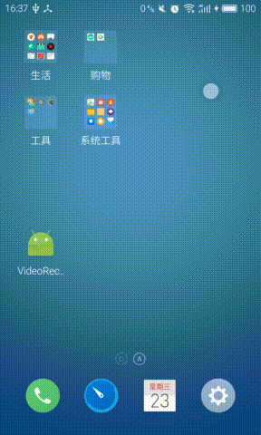

# VideoRecord
a demo show you how to record video on android by a custom camera

# feature
1. 草稿箱页面（显示手机拍摄的视频，长安视频可以弹出删除视频操作界面）
2. 手机相册页面 (显示手机sdcard中的视频文件)
3. 视频拍摄页面 (自动对焦，焦距调节，闪光灯，辅助线，倒计时，前后摄像头切换，拍摄功能)
4. camera预览 和 videorecord 分辨率调优 
5. 沉浸式状态栏体验
6. lazyfragment，fragment延时加载
7. 自定义下拉刷新框架，本地数据分页加载
8. 数据库扫描工具，sdcard视频扫描工具。
9. 自定义文件存储路径。

